# Guess Me a Drink !

 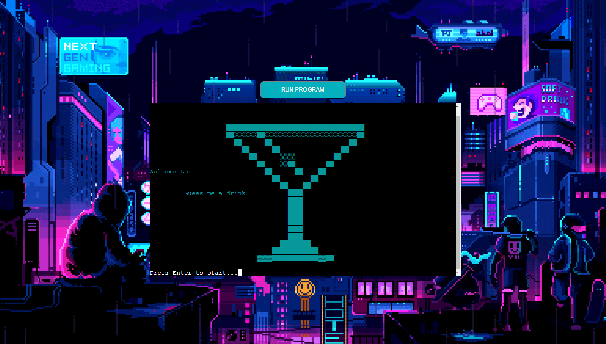

 ## Contents

- [Overview](#overview)
- [Scope](#scope)
- [Features](#features)
  - [Existing Features](#existing-features)
  - [Future Features](#future-features)
- [User Experience](#user-experience)
  - [User stories](#user-stories)
  - [Flowchart](#flowchart)
- [Design](#design)
  - [Colour Scheme](#colour-scheme)
  - [Layout](#layout)
- [Technologies Used](#technologies-used)
  - [Languages](#languages)
  - [Frameworks, Librarie and Programs Used](#frameworks-librarie-and-programs-used)
- [Testing](#testing)
  - [Validating](#validating)
  - [Fixed Bugs](#fixed-bugs)
- [Deployment](#deployment)
  - [Running the Program](#running-the-program)
  - [Deployment Process on Heroku](#deployment-process-on-heroku)
  - [Cloning](#cloning)
- [Credits](#credits)
  - [Content](#content)
  - [Media](#media)
- [Acknowledgments](#acknowledgments)

## Overview

 Guess Me a Drink is a Python-based command-line application designed to act as a cocktail advisor, assisting users in exploring and discovering a wide array of delicious cocktail recipes. Whether you're a seasoned mixologist, a cocktail enthusiast, or someone having trouble selecting a drink, this app serves as a fun resource for creating and enjoying cocktails tailored to your preferences.
 [View the deployed project here](https://guess-me-a-drink-f6468e586159.herokuapp.com/).

## Scope

 - **Efficient and Speed:** Users can swiftly find their ideal cocktail with just a few keystrokes.

 - **Recipe Access:** After suggesting a cocktail, users can easily access the recipe. This allows them to make, print, or share their chosen cocktail with friends and family.

 - **Seamless Restart:** Following a cocktail suggestion, users have the option to restart the advisor for another recommendation.

 - **Age Verification:** To promote responsible usage, the app includes age verification to prevent underage individuals from accessing cocktail content.

## Features

### Existing Features

 - **User-Friendly:** Guess Me a Drink is an intuitive and user-friendly interface that simplifies the cocktail selection process.

 - **Wide Range of Options:** Choose from a variety of spirit categories, each offering unique and tempting cocktail choices.
 
 - **Exciting Flavors:** Once you select a spirit category, explore a wide array of flavors to find the perfect match for your taste buds.

 - **Random Surprise:** Feeling adventurous? The "I'm feeling lucky" option surprises you with a random cocktail recipe every time.

 - **Customizable:** Add cocktails to your list and explore new ones starting fresh with each selection.

 - **Responsibility:** For users under 18, a friendly reminder to enjoy responsibly and a countdown displaying the time until reach legal drinking age.

### Future Features

 - **Mocktail Menu:** Introducing a dedicated mocktail menu for those seeking non-alcoholic options, catering to a wider audience including designated drivers and individuals preferring alcohol-free beverages.

 - **Order Menu Integration:** Enhancing the app's utility for bars and mixologists by working on an order menu feature to seamlessly integrate it into bars and restaurants, streamlining the cocktail ordering process.

 - **Expanded Recipe Collection:** Continuously adding more cocktail recipes for each spirit type, ensuring a diverse range of choices for users.

 - **Enhanced Recipe Sharing:** Enabling users to easily copy cocktail recipes for personal use, print them for reference, or share their favorite recipes with friends and family.

 These upcoming features will make Guess Me a Drink an even more comprehensive and engaging platform for cocktail enthusiasts, bartenders, and anyone looking to enhance their mixology skills.

## User Experience

### User stories

 - As a cocktail enthusiast, I want to use the application to discover new and exciting cocktail recipes.
 - I expect the app to recommend a variety of cocktails that align with my taste preferences.
 - As someone who occasionally enjoys a cocktail but struggles to choose from an extensive list, I want the app to provide quick and convenient cocktail suggestions.
 - As a user, I want the app's command-line interface to be user-friendly and easy to navigate.
 - I expect clear menus and instructions that guide me through the cocktail discovery process without any technical hurdles.

### Flowchart

 Flowchart was created using Draw.io to represent how the site works.

 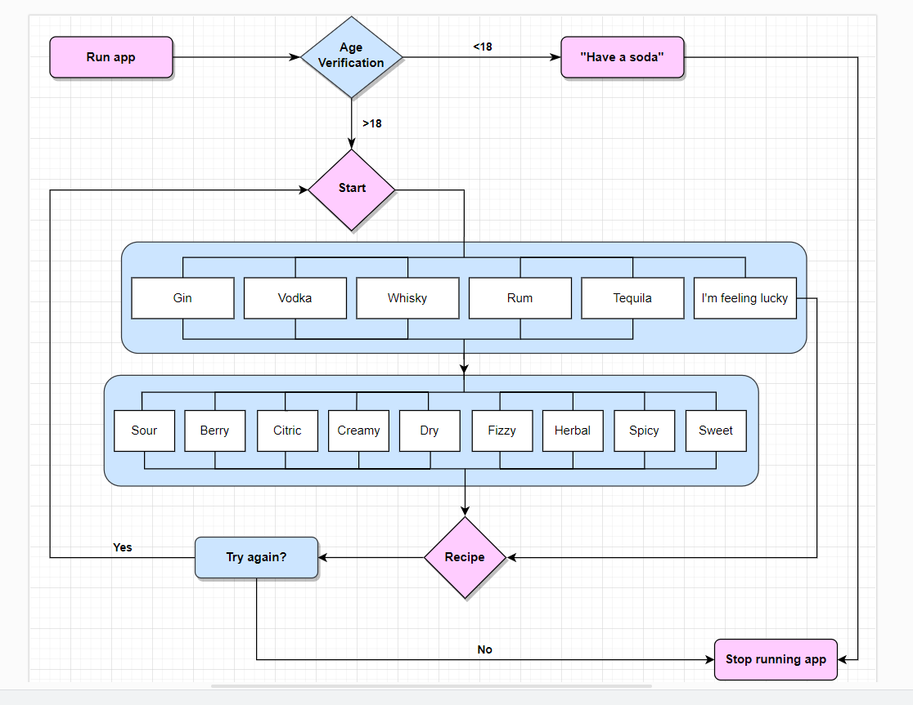

## Design

### Colour Scheme

 The color scheme, limited by the software, was designed to bring color to ASCII illustrations and highlight important text, enhancing the user experience:

 - **Cyan (Art):** Coloring ASCII art in cyan makes them visually appealing and helps them stand out within the application.

 - **Yellow (Highlighting):** Highlighting important text or elements in yellow draws attention to them, guiding users to critical information or menu options.

 - **Red (Alerts):** Using red for alerts or critical messages indicates urgency or importance, immediately capturing the user's attention when action or consideration is required.

### Layout

- Starting screen:

 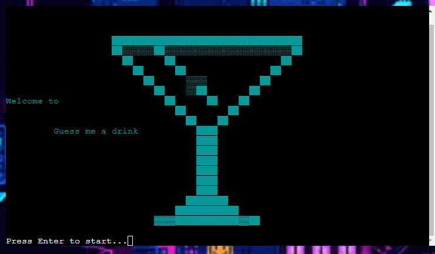

- Age verification:

 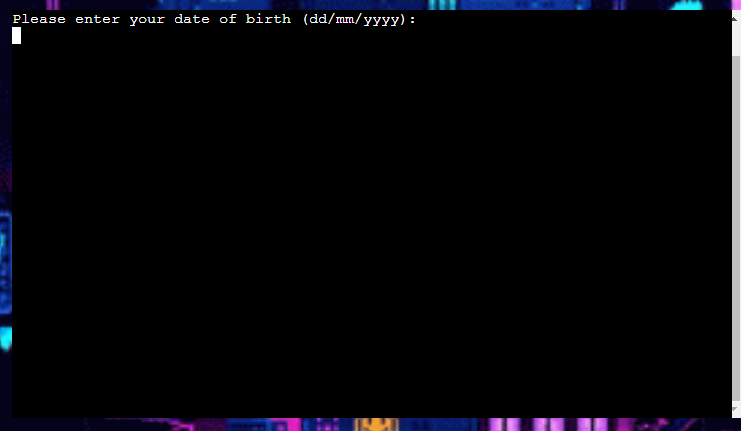

  - Invalid Age:

 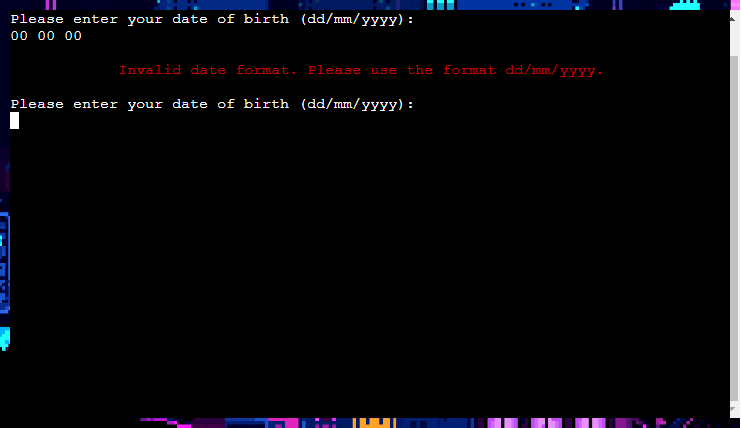

- Happy soda message for underages:

 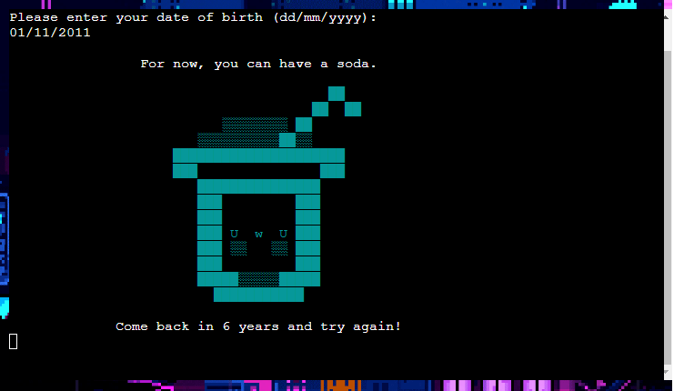

- Main menu of spirits:

 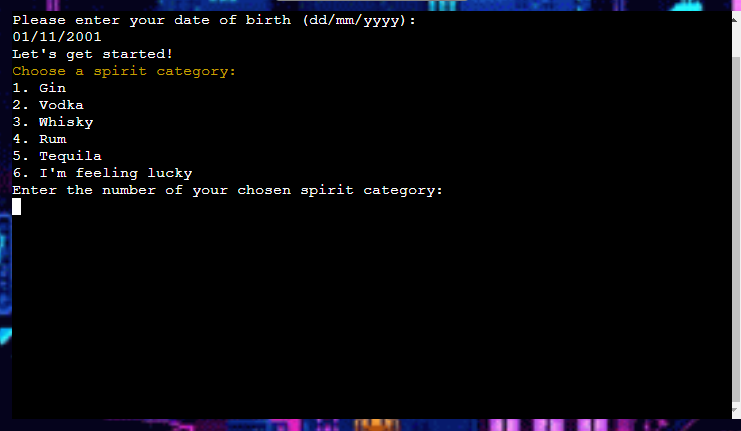

  - Invalid input:

 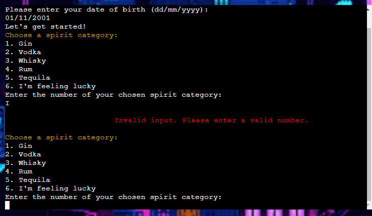

  - Invalid spirit selection:

 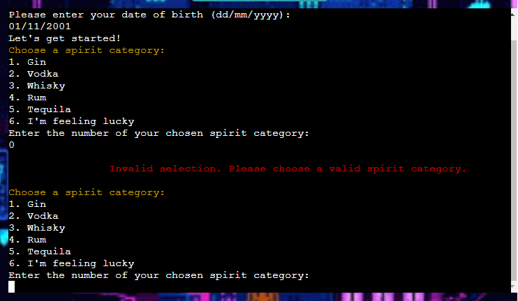

 - Random choice:

 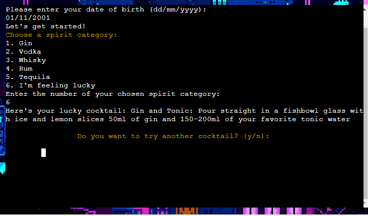

- Flavor menu:

 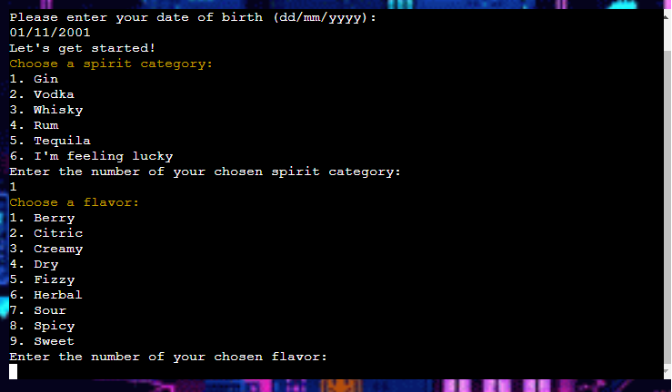

  - Invalid input:

 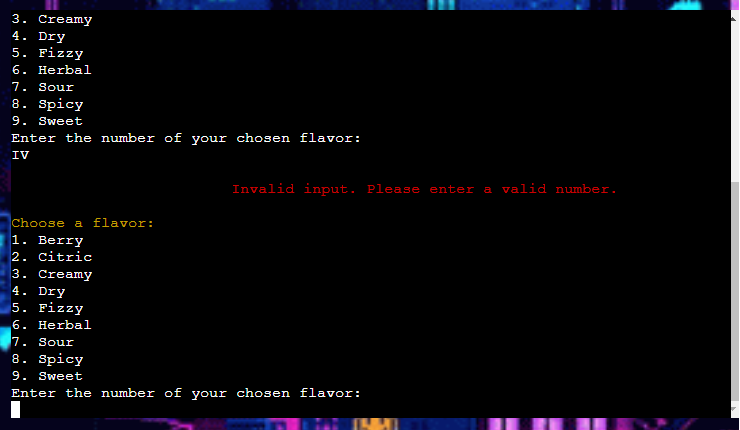

  - Invalid flavor selection:

 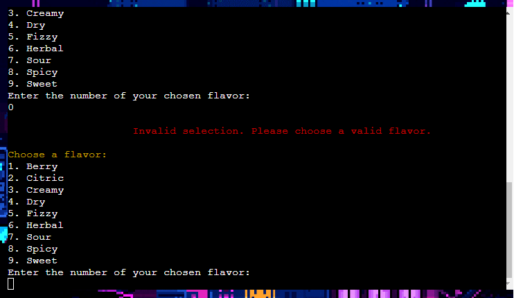

- Exit menu:

 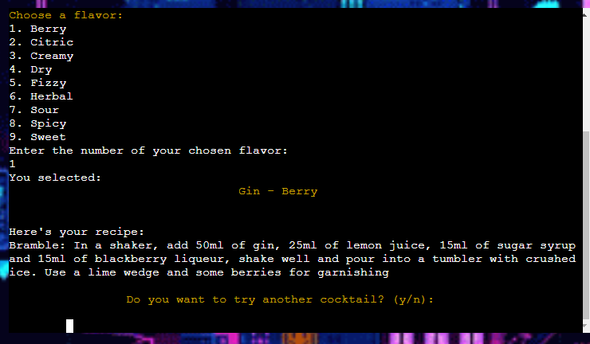

  - Invalid input:

 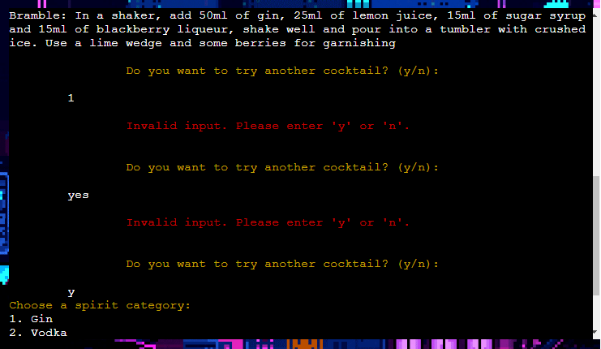

  - Continue:

 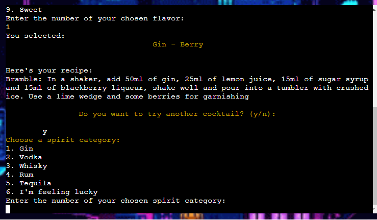

  - Stop running:

 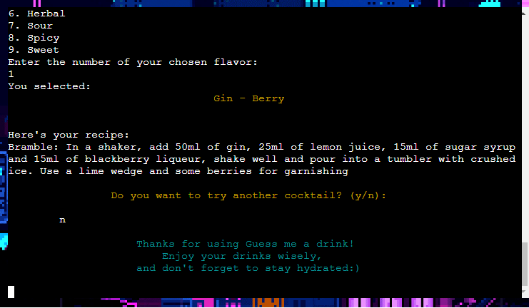

## Technologies Used

### Languages

 - [PYTHON](https://en.wikipedia.org/wiki/Python_(programming_language))

### Frameworks, Librarie and Programs Used

 - [Git](https://git-scm.com/): Version control via Gitpod terminal for testing, committing to Git, and pushing to GitHub.
 - [GitHub](https://github.com/patilacerda): Hosting the code.
 - [Heroku](https://www.heroku.com/): Deployment.
 - [Favicon](https://favicon.io/): Generating favicons.
 - [Google Sheets](https://docs.google.com/spreadsheets/d/1dTW-b3tbR5rhwOfA8_TJK_GZLOHFTAiQ5R7j4kqSTic/edit?usp=sharing): Hosting the recipes.
 - [Draw.io](https://www.drawio.com/): Creating flowchart.
 - [gspread](https://docs.gspread.org/en/latest/): Python API for Google Sheets.
 - [google-auth](https://google-auth.readthedocs.io/en/master/): Google authentication library for Python.
 - [Colorama](https://pypi.org/project/colorama/): Cross-platform printing of colored text.

## Testing

### Validating

 No errors were returned when passing through the [PEP8](https://pep8ci.herokuapp.com/).

 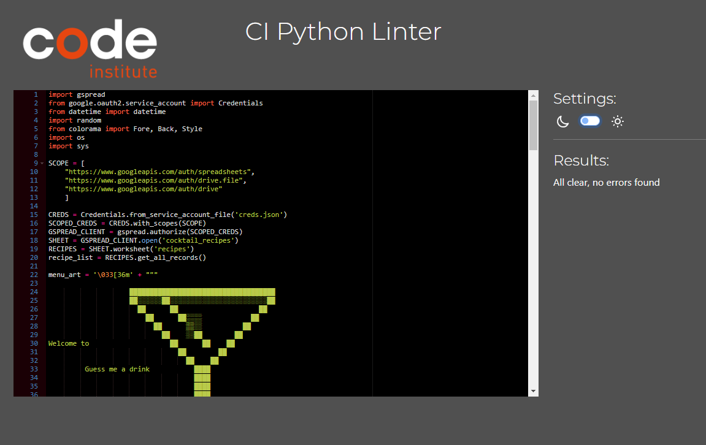

### Fixed Bugs

 - There was an error message encountered due to rate limiting by the Google Sheets API. It indicates that the script has exceeded the rate limit for read requests to the Google Sheets API, and is currently limited to 60 read requests per minute per user.

 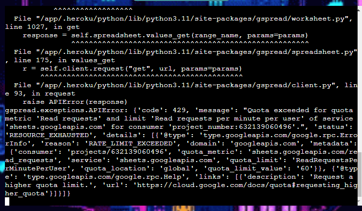

 - Removing the while True loop reduced these excessive read requests by fetching all records at once reducing the number of API requests significantly.

 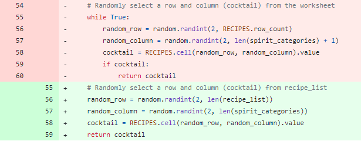

## Deployment

 This project was developed using the Python terminal template provided by Code Institute and hosted on GitHub. 

### Running the Program

 To run the program from the terminal on GitHub, execute the command 'python3 run.py'.

### Deployment Process on Heroku

 The deployment process on Heroku involved the following steps:

 1. Add dependencies to the 'requirements.txt' file in GitPod using the command "pip3 freeze > requirements.txt"
 2. Commit the changes and push to the GitHub repository.
 3. Access the Heroku Dashboard:
  Create a new app and assign a name and location.
 4. In the app's Settings tab, add Config Vars for credentials and port configuration.
 5. Configure buildpacks in the following order: Python and then NodeJS.
 6. Choose the appropriate deployment method by selecting GitHub.
 7. Connect the Heroku app to the GitHub repository.
 8. Optionally, enable automatic deployment or manually trigger the deployment process.
 9. Finally, click on "Deploy" to initiate the deployment process to Heroku.

### Cloning

To clone the repository, follow these steps:

 1. Locate the [repository link](https://github.com/patilacerda/GuessMeADrink_PP3/) on GitHub.
 2. Under the 'Code' button, you will see different cloning options, including HTTPS, SSH, and GitHub CLI. Click on your preferred cloning option.
 3. Copy the URL provided.
 4. Open your Terminal or Command Prompt.
 5. Navigate to the directory where you want to create the local clone. You can use the cd command to change the current working directory.
 6. Type the command "git clone <https://github.com/patilacerda/GuessMeADrink_PP3/>"
 7. Press 'Enter' to execute the command. This will create a local clone of the repository in the specified directory.

## Credits

### Content

 Knowledge gathered from the following sources:

 - Stack Overflow - Utilized information from discussions and guidance related to the [os](https://stackoverflow.com/questions/2084508/clear-terminal-in-python) and [sys](https://stackoverflow.com/questions/14639077/how-to-use-sys-exit-in-python) modules.
 - Love Sandwiches Walkthrough project - Incorporated insights and utilized the gspread module from this project.

### Media

 Recipes Sources:

 - [IBA - International Bartender Association](https://iba-world.com/)
 - [BBC food](https://www.bbcgoodfood.com/recipes)
 - [Licquor.com](https://www.liquor.com/recipes)

 Visual Media Sources:

 - ASCII art inspired from [Text Art](https://textart.sh/topic/drink) 
 - Background from [ArtStation](https://www.artstation.com/artwork/GXwZgz)

## Acknowledgments

 Developing this project has been an incredible journey, inspired by cherished moments with my oldest friends and reminiscing about the time I met my husband. My first registered job in a club introduced me to diverse people with varying drink tastes, and my husband played a significant role in teaching me everything I know about mixology.

 A sincere thank you to my mentor, Antonio Rodriguez, whose guidance and assistance were invaluable during the final adjustments of this project.

 To all my friends who dedicated their time to test the program, your support and enthusiasm have been incredibly valuable.

 Your contributions, encouragement, and presence have turned this project into a reality, and I couldn't have achieved this without each one of you. Thank you all for being a part of this journey!

